# 🧑‍💻 SKN17-3rd-1Team: Axiom
> SK네트웍스 Family AI캠프 17기 - 3차 프로젝트 1팀  
  개발 기간: 2025.09.08 ~ 2025.09.25

<br>

# 📌 목차
1. [팀 소개](#1️⃣-팀-소개)  
2. [프로젝트 개요](#2️⃣-프로젝트-개요)  
3. [기술 스택 & 사용한 모델](#3️⃣-기술-스택)  
4. [시스템 아키텍처](#4️⃣-시스템-아키텍쳐)  
5. [WBS](#5️⃣-wbs)  
6. [요구사항 명세서](#6️⃣-요구사항-명세서)  
7. [수집한 데이터 및 전처리 요약](#7️⃣-데이터-및-전처리)  
8. [DB 연동 구현 코드](#8️⃣-db-연동-구현-코드)  
9. [테스트 계획 및 결과 보고서](#9️⃣-테스트-계획-및-결과-보고서)  
10. [프로그램 성능 개선 노력](#🔟-진행-과정-중-프로젝트-개선-노력)  
11. [수행 결과(테스트/시연 페이지)](#*️⃣-수행-결과)  
12. [한 줄 회고](#✳️-한-줄-회고)  

<br>
<br>

# 1️⃣ 팀 소개
#### ✅ **팀명: Axiom**
> 단순함이 궁극의 정교함이다

#### ✅ **팀원 소개**

| [@김주영](https://github.com/samkim7788)                      | [@김준협](https://github.com/use08168)                       |  [@맹지수](https://github.com/happyfrogg)                       | [@이민영](https://github.com/mylee99125)                       | [@조세희](https://github.com/tpgml6513)                       |
|---------------------------------------------------------------|---------------------------------------------------------------------|---------------------------------------------------------------------|---------------------------------------------------------------------|---------------------------------------------------------------------|
| 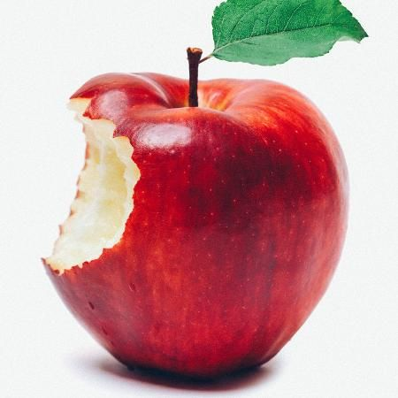         | | 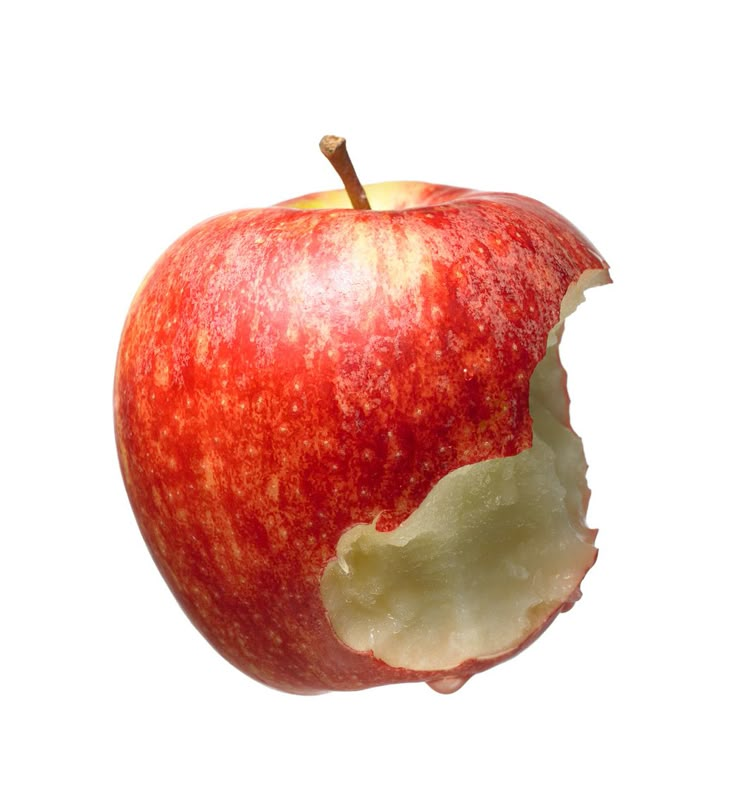             |  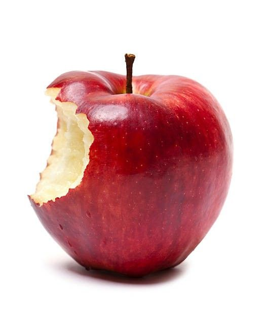|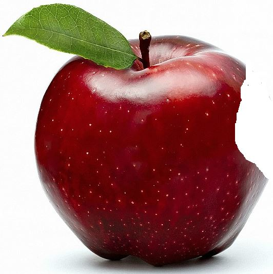|

<br>
<br>


# 2️⃣ 프로젝트 개요

## ✅ 프로젝트 소개: Chative Jobs

**Chative Jobs**는 사용자의 마케팅 기획안에 대해, Apple의 마케팅 전략과 브랜딩 아이디어 기반으로 스티브 잡스에게 직접 컨설팅 받는 듯한 경험을 제공하는 **AI 기반 마케팅 컨설팅 챗봇**입니다.

<br>

## ✅ 프로젝트 필요성
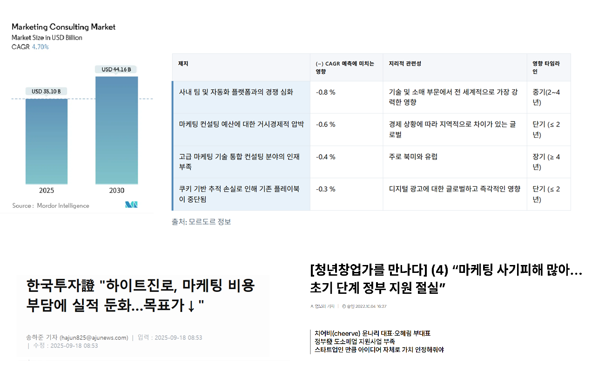

출처: [https://www.mordorintelligence.kr/industry-reports/marketing-consulting-market](https://www.mordorintelligence.kr/industry-reports/marketing-consulting-market)

> 마케팅 컨설팅 시장은 매년 성장하며 2025년에는 약 35억 달러 규모로 추산됩니다. 하지만 이러한 외형적 성장에도 불구하고, 기존 컨설팅 서비스는 고질적인 비효율성을 안고 있습니다.

- **높은 비용 부담 및 접근성 한계**
  - 마케팅 산업이 고도화되고 개인화된 전략의 중요성이 커지면서, **전문 컨설팅 서비스 비용이 점점 높아**지고 있음
  - 컨설팅 과정에서 사용되는 전문 용어에 대한 해석이 어려워 **일반인의 이해에는 한계**
- **획일화된 컨설팅과 혁신의 부재**
  - 고객 유치를 위해 **획일화된 성공 사례에 의존**하는 경향을 보임
- **마케팅 컨설팅 산업 규모의 확대로 사기 피해 급증**
  - **사기성 컨설팅**으로 피해를 주는 경우가 증가하고 있음

<br>

위 문제를 해결하기 위해, 저희 팀은 다음과 같이 챗봇을 개발하였습니다.
- **비용 부담 없이 초기 상담을 제공**하고, 사용자의 니즈에 맞는 마케팅 전략 아이디어를 가볍게 나눌 수 있는 창구를 제공하면서,
- **학술지에 등록된 논문**을 통해 높은 신뢰도를 갖는 마케팅 전략에 대해 안내할 수 있도록 하고,
- 획일화된 컨설팅에서 벗어나, Apple의 창업자 **스티브잡스의 철학**을 반영하고, 스티브잡스의 **단순한 어휘와 특징**을 표현하도록 하였습니다.


<br>

## ✅ 프로젝트 목표

### 📈 **혁신적 아이디어 도출을 위한 AI마케팅 컨설턴트 구축**
    
* 단순 마케팅 전략을 넘어, 스티브잡스 페르소나를 기반으로 혁신적인 아이디어 제공**
* **RAG** 기술을 활용해 학술 자료에 기반한 답변의 **신뢰성**과 **정확성** 확보
    
### 👤 **사용자 친화적인 마케팅 전략 지원 시스템 구현**
    
* 마케팅 기획안(PDF)의 간편한 업로드를 통한 사용자의 **복잡한 요구사항**을 한번에 파악
    
### 💸 **창업자와 마케터의 의사결정 지원**
    
* 기존 마케팅 컨설팅의 한계로 인해 컨설팅을 망설이던 **스타트업, 프리랜서, 개인 사업자**가 비용 부담없이 초기 아이디어를 검증할 수 있도록 지원
* 스티브잡스 페르소나를 통해 사용자에게 **비즈니스에 대한 새로운 시각** 제시

<br>
<br>


# 3️⃣ 기술 스택과 모델
## 🔧기술 스택

<br>

| 카테고리 | 기술 스택 |
|----------|-------------------------------------------|
| **사용 언어** |  |
| **LLM** |   |
| **벡터 데이터베이스** |  |
| **임베딩 모델** |  |
| **실행 환경** |  |
| **모델 튜닝/학습 프레임워크** |    |
| **인터페이스(UI)** |  |
| **형상 관리 및 협업** |     |


<br>

## 🤖 사용한 모델: [`K-intelligence/Midm-2.0-Mini-Instruct`](https://huggingface.co/K-intelligence/Midm-2.0-Mini-Instruct)

### ✅ 모델 선정 기준
* 한국어에 최적화된 모델일 것
* 정해진 출력 형식을 유지할 것
* 소량의 데이터로도 파인튜닝이 가능할 것
* 적은 자원으로 빠른 응답이 가능할 것


### ✅ 사용한 모델의 특징과 장점
> (참고) Instruct 버전으로, 복잡하고 다양한 명령을 정확하게 이해하고 수행하도록 훈련되었음

* **압도적인 한국어 최적화**
  → KT가 개발한 언어 모델로, 1조 토큰 이상 방대한 데이터를 학습하였고, 기업의 비즈니스 목적에 맞게 활용할 수 있도록 개발
  → 한국어와 한국 문화에 특화되어 있음  

* **뛰어난 명령 수행 능력**  
  → 사용자의 복합적인 지시를 정확히 이해하고 수행함
  → 답변 포맷 및 특정 페르소나를 일관되게 유지하는 데 유리

* **경량화 구조**  
  → 추론 속도가 빠르고, 적은 자원으로 실행 가능함

* **오픈소스 접근 가능성**  
  → 커스터마이징 및 배포가 자유로움 (Apache 2.0 라이선스)

### 📌 선택 이유 요약

* 스티브잡스의 어조와 화법을 한국어로 완벽하게 재현하기 용이 
* RAG와 페르소나 지시를 결합한 복합 명령을 정확하게 수행
* 추론 속도와 리소스 효율성이 뛰어남  

### 📚 모델 정보

* **제작자**: KT 
* **기술 리포트**: [믿:음 2.0 Technical Report](https://ai.kt.com/resources/detail01?v=20250722)  
* **라이선스**: Apache 2.0  
* **모델 페이지**: [HuggingFace 링크](https://huggingface.co/K-intelligence/Midm-2.0-Mini-Instruct)


<br>
<br>


# 4️⃣ 시스템 아키텍처

## ✅ 시스템 아키텍처

Chative Jobs는 **RAG**와 **파인튜닝**이 결합된 하이브리드 아키텍처를 사용.  

📌 구성 요소  
- **FAISS 벡터 DB**: 사실적 근거 기반 문서 검색  
- **K-intelligence 기반 파인튜닝 LLM**: 스티브잡스 페르소나에 맞는 말투와 문체로 재구성한 응답 생성  

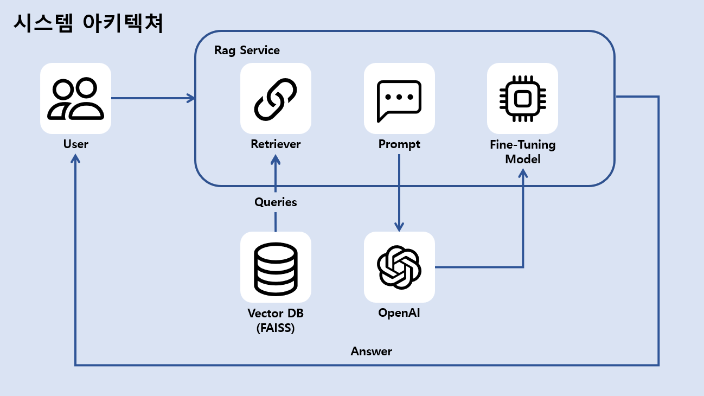

<br>

## ✅ 시스템 플로우

📌 구성 요소  
1. **질문 입력**  
   사용자가 마케팅 기획안(PDF)을 업로드 또는 자연어로 질문 입력

2. **문서 검색**  
   FAISS 벡터 DB에서 의미 유사도가 높은 마케팅 기획안과 논문 청크 검색

3. **프롬프트 구성**  
   검색된 문서와 질문을 결합하여 하나의 입력 프롬프트로 생성

4. **모델 응답 생성**  
   파인튜닝된 LLM이 스티브잡스 페르소나에 맞는 구조화된 답변을 생성

5. **응답 출력**  
   완성된 답변을 사용자에게 제공


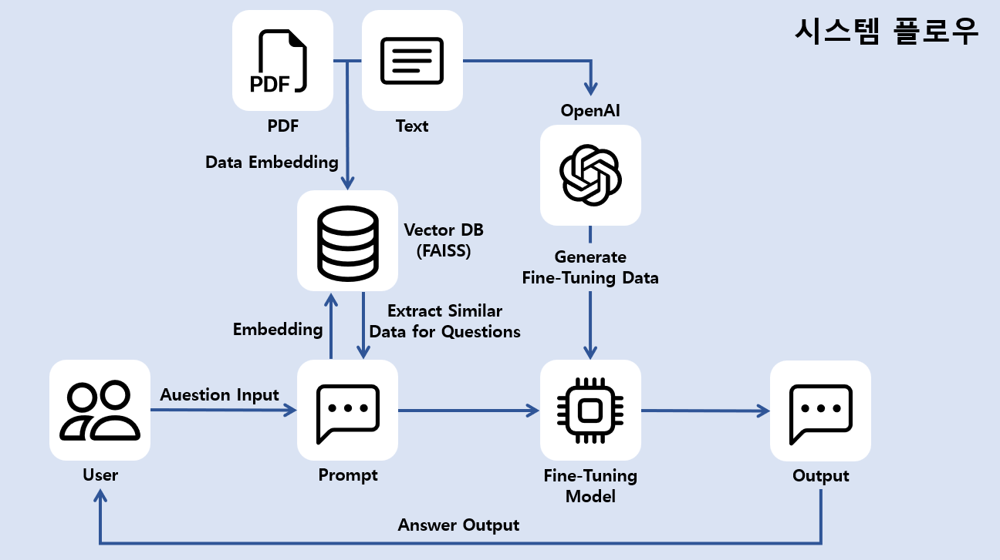


<br>
<br>


# 5️⃣ WBS
프로젝트 기간: 2025-09-08 ~ 2025-09-25
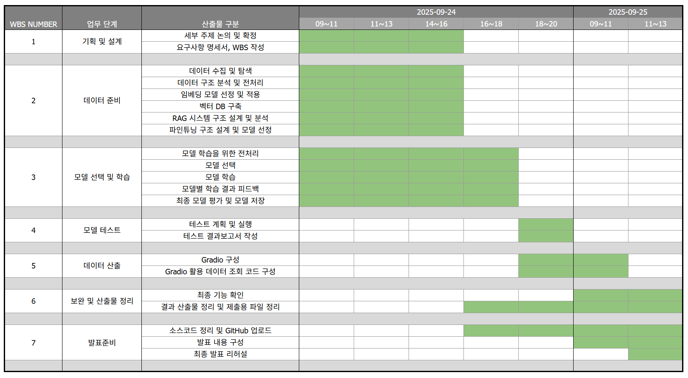


<br>
<br>


# 6️⃣ 요구사항 명세서

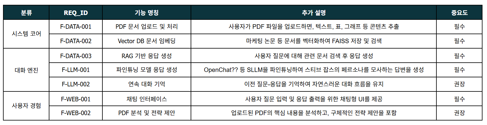


<br>
<br>


# 7️⃣ 데이터 및 전처리

- 논문 데이터를 보여줘야 함
- 최종적으로 어떤 형식으로 변환했는지

## ✅ RAG용 문서 데이터 (마케팅 논문 데이터)
- **목적**: 학술적 근거를 기반으로 신뢰성 높은 마케팅 전략을 제공하기 위한 지식 기반 구축
- **출처**: 국내외 학술지
- **전처리 과정**:
<br>
  
  <br>
  
  

  - `PyMuPDF` 라이브러리 사용하여 PDF 텍스트 추출
  - 불필요한 공백, 줄바꿈 제거 및 특수문자로 분리된 단어 결합
  - Chunking: 마침표와 쉼표 기준으로, 문장 단위로 분할
  - 데이터셋 생성: 전처리된 논문 기반으로 `id`에 논문명에 인덱스를 부여하여 json 파일로 생성
- **최종 확보량**: **56,079개**


## ✅ 파인튜닝 데이터 1. 스티브잡스 키노트 및 연설 스크립트
- **목적**: LLM에 스티브 잡스의 철학과 화법을 내재화하여, 마케팅 전략 분석 등 특정 과제에 대한 페르소나 기반 답변 생성을 목표로 함
- **출처**: 스티브 잡스의 생전 키노트 및 스탠포드 연설 영상
- **전처리 과정**:
  - `STT`: `Whisper` 모델로 영상의 음성을 텍스트로 추출
  - Semantic Chunking: `NLTK`로 문장 분리 후, 벡터 임베딩과 통계분석을 통해 의미 단위의 문단으로 재구성
  - 데이터셋 생성: 수집된 텍스트 기반 질의응답 쌍 생성
- **최종 확보량**: 총 **300개 질의응답 쌍**


## ✅ 파인튜닝 데이터 2. 기업 마케팅 기획안 PDF
- **목적**: 사용자가 제출한 기업 마케팅 기획안 PDF를 분석하여 잘한 부분과 보완해야 할 부분에 대한 피드백을 제공하고, 사용자의 질문에 답변하기 위한 기반 데이터를 구축하는 것을 목표로 함
- **출처**: 공모전 및 기업 공개 데이터 
- **전처리 과정**: 
  - `LlamaParse`: 수집된 pdf 파일을 고해상도 OCR 및 테이블 추출 기능을 활용해 복잡한 레이아웃을 포함한 한국어 텍스트와 HTML 테이블을 Markdown 형식으로 변환
  - 데이터셋 생성: 수집된 Markdown 데이터 기반으로, 기획안의 주요 섹션을 식별하여 질의응답 쌍 생성
- **최종 확보량**: 총 **354개 질의응답 쌍**
- **가공 전 , 후**
  -  
- 파인튜닝 데이터 예시
   ```
   {"messages": [
   {"role": "user", "content": "**'솔로-다이닝' 1인 식당 예약 및 커뮤니티 앱**\n\n- **기능:** 1인 손님을 환영하는 식당(바 테이블 등)을 찾아 예약하고, 같은 식당에 예약한 다른 '혼밥러'들과 앱 내에서 가벼운 대화를 나눌 수 있는 기능.\n- **타겟:** 혼자 밥 먹는 것을 즐기지만, 때로는 새로운 만남을 원하는 20-30대 1인 가구.\n\n- **질문:** 저희 앱은 '혼자의 자유'와 '함께하는 즐거움'이라는, 다소 모순적인 두 가지 가치를 동시에 추구합니다. 이 아슬아슬한 경계선을 어떻게 마케팅적으로 풀어내야 할까요?"},
   {"role": "assistant", "content": "당신들은 지금 '모순'이라고 말했지만, 그것이야말로 당신들 앱이 가진 가장 강력한 '매력'입니다. 사람들은 완벽한 혼자도, 불편한 함께도 원하지 않아요. 그들은 그 사이의 완벽한 균형을 원합니다.\n\n### 새로운 장르의 정의\n\n당신들 서비스는 '식사' 앱이 아닙니다. 이것은 **'느슨한 연대'**를 위한 소셜 클럽입니다.\n\n### 어떻게?\n\n* **메시지:** **\"혼자여도 괜찮지만, 함께라면 더 좋을 때.\"** 이 메시지를 전하세요. 우리는 당신의 자유를 존중하지만, 원한다면 언제든 기분 좋은 연결이 가능하다는 것을 알려줘야 합니다.\n* **경험 디자인:** 앱 내에서의 대화는, 상대방이 수락해야만 가능하게 만드세요. 원치 않는 말에 방해받지 않을 권리를 완벽하게 보장해야 합니다. 하지만 같은 공간, 같은 음식을 즐기고 있다는 그 사실만으로도, 사람들은 보이지 않는 유대감을 느끼게 될 겁니다.\n\n> 당신들은 식당 예약 앱이 아닙니다. 당신들은 도시의 외로운 개인들이, 서로의 자유를 침범하지 않으면서도, 기분 좋은 유대감을 나눌 수 있는, 세상에서 가장 세련된 **'도시인의 사교 클럽'**을 만드는 겁니다."}]}
   ```


## ✅ 사용자 입력 PDF 데이터
- **목적**: 사용자가 제공한 PDF 파일을 더 잘 이해하고 분석하기 위한 기반 데이터를 구축하는 것을 목표로 함 
- **전처리 과정**: 
  - `pymupdf4llm`: 사용자가 업로드한 PDF 파일에서 텍스트와 테이블을 Markdown 형식으로 추출하여 데이터 변환

<br>
<br>


# 8️⃣ DB 연동 구현 코드

- [**📂 마케팅 논문 DB**](https://drive.google.com/drive/folders/1beKdU9ubUineNask3Zuled52i8iDrJ-x?usp=drive_link)

### ✅ DB 선정 이유

* `FAISS` 기반 Vector DB로 저장하여 RAG 검색 시스템에 최종 연동
* `Chroma`에 비해 속도가 빠름

<br>
<br>


# 9️⃣ 테스트 계획 및 결과 보고서

## 🧪 평가 방식

모델 응답은 정확성, 컨텍스트 관련성, 컨텍스트 충실성, 고객 친화 기능 구현 여부 기준으로 평가함:

#### . 응답 정확성 
  - 생성된 답변이 참조 답변과 비교해서 정확한 정보인지 평가 (BERTScore 기반)
#### . 컨텍스트 관련성
  - 검색된 컨텍스트가 질문에 대답하기 위해 관련성이 높은지 평가
  - 검색된 문서 중 실제 답변에 도움되는 문서의 비율 (Precision 활용)
#### . 컨텍스트 충실성
  - 생성된 답변이 주어진 컨텍스트에 기반하는지 평가
  - 정답을 구성하는 데 필요한 문서를 빠짐없이 찾아오는 비율 (Recall 활용)
#### . 고객 친화 기능 구현
  - PDF 업로드, 답변 생성과 같이 서비스를 사용함에 불편함이 없는지 평가

<br>

## 📊 테스트 결과
- 테스트 Q&A <br>
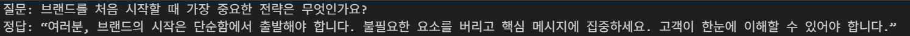|
<br>

- 테스트 질문 & 모델 답변 <br>
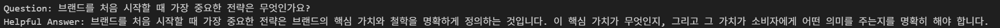|
<br>
- 결과 <br>
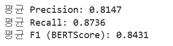|

| 항목 | 결과 |
|------|------|
| 응답 정확성 | **84.3점** |
| 컨텍스트 관련성 | **81.5점** |
| 컨텍스트 충실성 | **87.3점** |
| 고객 친화 기능 | **100.0점** |

<br>

## ✅ 테스트 결론

- **기능 안정성**  
  : PDF 업로드, 답변 생성 등 **핵심 기능이 정상적으로 작동**함  
- **답변 정확성**  
  : 논문 기반 검색 결과 답변이 **평균 84% 이상 정확도** 로 평가됨 

또한 동일 질문에 대해 **논리 흐름과 정보 일관성을 유지**하며,  
실제 마케팅 컨설팅 초기 상담 상황에서 요구되는 **명확성, 실용성, 신뢰성** 모두 충족


<br>
<br>


# 🔟 진행 과정 중 프로그램 개선 노력

## 개선 전 문제점

#### 문제점 1. 응답 지연
✅ 개선방법: 모델 교체 및 성능 비교 테스트
  - `gpt-oss-20b`: 메모리 문제
  - `qwen-3`: 속도 문제 - 응답시간 약 1~8분 소요
  - `solar-10.7b-v1.0`: 속도 문제 - 응답 시간 5분 이상 소요

#### 문제점 2. 응답 형식 구조화
✅ 개선방법:
  - 프롬프트 `json` 템플릿화
  - 프롬프트 엔지니어링
  - 파인튜닝

#### 문제점 3. 로컬에서 파인튜닝 후 모델 작동 문제 (메모리 이슈)
  - 10B 이상의 모델은 로컬 환경에서 작동하지 않았음

✅ 개선방법:
  - Runpod(A40 GPU) 환경에서 재실행

#### 문제점 4. 기획안(PDF) 구조를 읽어오지 못함
  - PDF를 txt 형식으로 변환하여 읽어오는 과정에서 특정 부분을 이해하지 못함
  - `pymupdf4llm`를 바탕으로 Markdown 형식으로 변환함으로써 모델이 PDF를 잘 이해함

#### 문제점 5. 프론트엔드에서 PDF 렌더링 문제
  - PDF를 직접 렌더링을 하게 될 경우, 텍스트가 깨지는 문제 발생

✅ 개선방법:
  - PDF를 이미지로 변환하여 고화질로 보여줌으로써, 문제 해결

<br>

## 기대 효과
- 마케팅 컨설팅에서 요구되는 **정확성, 신뢰성, 실용성**을 갖춘 답변 제공
- **일반 사용자도 이해할 수 있는 구조화된 응답** 구현
- 기존 컨설팅 대비 **비용 부담 완화**와 **초기 아이디어 검증** 지원
- 실제 비즈니스 현장에서 적용 가능한 **AI 기반 컨설팅 서비스 확장 가능성** 확보

<br>

## 한계점 
- 경량 모델 부족: 로컬 환경에서 실행 가능한 가벼운 모델 탐색 필요
- 계산 한계: 논문데이터 기반 학습으로 정량적 계산 및 수치 연산 대응 미흡
- 외부 접근 제약: 툴을 통한 외부 링크/실시간 정보 활용 기능 제한

<br>

## 🔧 향후 개선 방향

| 항목 | 내용 |
|------|------|
| 경량 모델 탐색 | 로컬 환경에서 실행할 수 있는 모델 탐색 및 양자화 적용 |
| 계산 기능 | 외부 계산 엔진/툴 연동으로 보완 |
| 데이터셋 확장 | 최신 마케팅 트렌드, 산업별 성공 사례 지속적 데이터 업데이트 |
| 응답 속도 최적화 | 대용량 문서 처리 속도 개선 |
| 페르소나 정교화 | 스티브잡스 화법의 맥락적 자연스러움 강화 |


<br>
<br>


# *️⃣ 수행 결과

### ✅ 최종 결과
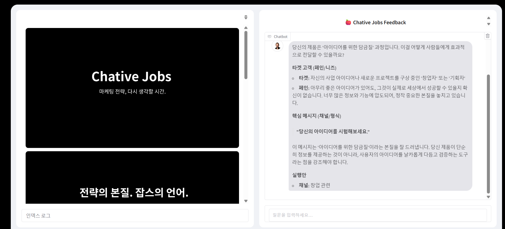


<br>
<br>

## 그리고 하나 더..

<br>
<br>
<br>

# ✳️ 한 줄 회고
| 항목 | 내용 |
|------|------|
|  김주영 |  |
| 김준협 | 파인튜닝 과정에서 단순히 텍스트 형식 뿐만아니라 마크다운과 같은 다양한 데이터도 파인튜닝 데이터로 사용 가능하다는 점을 알게 되어 다양한 데이터로 파인튜능을 해봐야겠다는 생각이 들었다 |
| 맹지수 |  |
| 이민영 |  |
| 조세희 |  |

<br>
